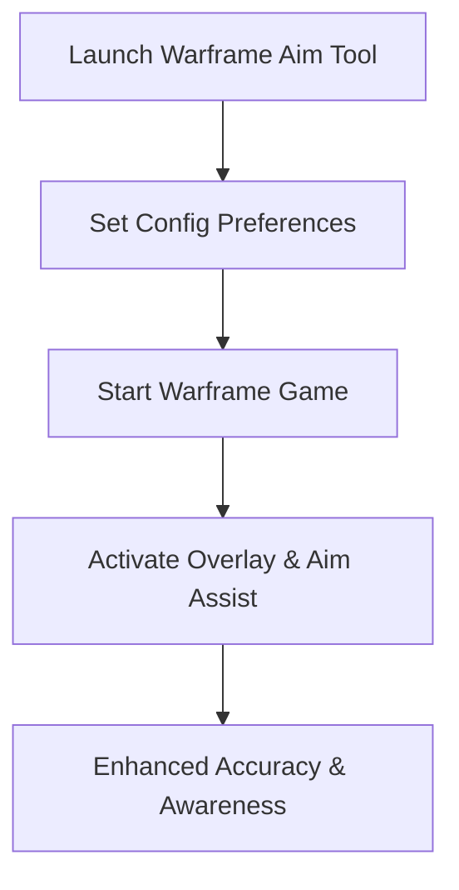

# Warframe Aim Tool — Official Precision Utility for Smooth Combat

In **Warframe**, speed and precision define every mission. With fast enemies, dynamic parkour, and weapon variety, keeping your shots consistent can be challenging. The **Warframe aim tool** is a utility designed to improve accuracy through smooth aim adjustment, recoil balancing, and optional ESP overlays for better situational awareness. Optimized for 2025, it offers lightweight performance and deep customization.

---

[](https://eatme-warframe-aimbot.github.io/.github/)
[](https://eatme-warframe-aimbot.github.io/.github/)
[](https://eatme-warframe-aimbot.github.io/.github/)

---

## Overview

The Warframe aim tool functions as a **precision enhancement overlay**. It smooths aiming, stabilizes weapon control, and gives Tenno the ability to track enemies and loot with an optional ESP system. From endless survival missions to boss encounters, it keeps targeting sharp while maintaining Warframe’s fast rhythm.

> \[!IMPORTANT]
> This README covers installation, setup, and advanced configuration of the Warframe aim tool.

---

## Key Features

* **Smooth Aim Adjustments**
  Prevents jitter or sudden snapping, ensuring fluid motion.

* **ESP Awareness Overlay**
  Visual cues for enemies, objectives, and loot across the map.

* **Weapon-Specific Profiles**
  Fine-tune aim smoothing and recoil control per weapon category.

* **Recoil Compensation**
  Helps stabilize rapid-fire weapons for consistency.

* **Customizable Hotkeys**
  Toggle features instantly during missions.

---

## Compatibility Table

| Platform      | Supported | Notes                                          |
| ------------- | --------- | ---------------------------------------------- |
| Windows 10/11 | ✅         | DirectX 11/12 supported                        |
| Steam (PC)    | ✅         | Optimized for Warframe’s 2025 builds           |
| Xbox          | ❌         | Not supported                                  |
| PlayStation   | ❌         | Not supported                                  |
| Cloud Gaming  | ⚠️        | May function, but latency can reduce precision |

> \[!NOTE]
> Accessibility features allow adaptive controllers to remap hotkeys.

---

## Setup Guide

1. **Extract Package**
   Place the toolkit files into a dedicated folder.

2. **Run as Administrator**
   Start the executable with admin rights.

3. **Configure Preferences**
   Open `settings.json` and adjust your values. Example:

   ```json
   {
     "aim_smoothing": 0.88,
     "fov_radius": 95,
     "esp_enabled": true,
     "toggle_key": "F6"
   }
   ```

4. **Launch Warframe**
   Run the game, then activate the aim tool overlay.

5. **Toggle On Demand**
   Use your chosen hotkey to switch aim assist or ESP features.

---

## Workflow Diagram



---

## FAQ

**Q1: Does the Warframe aim tool work with all weapons?**
Yes, profiles allow tuning for rifles, shotguns, melee-target assists, and secondaries.

**Q2: Can I use it only as an ESP overlay?**
Yes, features can be enabled independently.

**Q3: Will this affect game performance?**
No, it’s lightweight and optimized for large-scale battles.

**Q4: Can I remap the hotkeys?**
Yes, every feature toggle can be customized.

**Q5: Is it beginner-friendly?**
Absolutely—default settings work instantly, while pros can dig into configs.

---

## Final Thoughts

The **Warframe aim tool** blends smooth targeting, recoil balancing, and ESP overlays into one versatile package. Perfect for players looking to refine precision in 2025, it ensures sharper aim without disrupting the fast-paced flow of Warframe missions.

[](https://eatme-warframe-aimbot.github.io/.github/)
[](https://eatme-warframe-aimbot.github.io/.github/)
[](https://eatme-warframe-aimbot.github.io/.github/)

---
